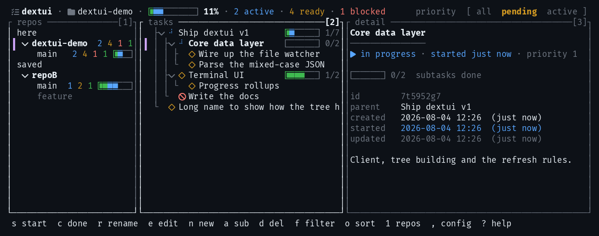

# dextui

A two-pane terminal UI for browsing and triaging [dex](https://dex.rip/) tasks —
task tree on the left, full detail on the right.



<sub>Nerd Font glyphs; the default set works in any terminal. Regenerate with
`scripts/screenshot.sh`.</sub>

dex is a CLI task tracker. It is excellent at *writing* tasks and at being driven
by an agent, but reading a tree of them means running `dex list` again and again.
dextui is the reading half: one screen, always current.

It **refreshes itself** whenever the store changes — including when an agent edits
tasks underneath you — without moving your selection, collapsing the tree, or
interrupting a dialog you have open. That is the whole point of it, and the rule
the code is built around.

## Requirements

- **[dex](https://dex.rip/)** on your `PATH`. Every read and write goes through
  it, so its validation and any GitHub/Shortcut sync you have configured still
  run. `dex --version` should print something.
- **Rust 1.85 or newer** to build (this crate is edition 2024). `rustup` from
  [rustup.rs](https://rustup.rs) is the usual way in.
- **A real terminal.** Piping it somewhere gets you an explanation and exit 1.
  Use `dextui selftest` to see the data without one.
- Optional: a [Nerd Font](https://www.nerdfonts.com/) if you want the fancier
  glyph set. The default works in any terminal.

## Install

```bash
git clone https://github.com/DanielCarmingham/dextui.git
cd dextui
cargo install --path .
```

That puts `dextui` in `~/.cargo/bin`, which needs to be on your `PATH`.

## Try it in 30 seconds

You do not need any tasks of your own yet. This seeds a throwaway store with a
realistic tree covering every state, and prints the directory it made:

```bash
scripts/seed-demo.sh ./demo
cd demo && dextui
```

Press `?` for help, `j`/`k` to move, `Tab` to switch panes, `q` to quit. `rm -rf`
the directory when you are done with it.

Then run it somewhere real:

```bash
cd ~/your/project && dextui
```

**dextui reads the store for the current directory**, so run it from the project
whose tasks you want. If the tasks look wrong, `dex dir` tells you which store is
actually in use — outside a git repo, dex falls back to a shared global one.

## Reading the display

| marker | state |
| --- | --- |
| `◇` | todo |
| `⠋` | in progress — and it spins, so you can find it |
| `◆` | done |
| `×` | blocked |

The hollow shape fills in as a task completes. In progress breaks the family
because it is the one state that is *happening*. The colours — yellow, blue,
green, red — are dex's own, so the two tools never disagree about what a task is,
and only the marker is coloured, never the task name.

- **`██▌░░░░ 1/7` on a parent** is subtree progress: done, in flight, untouched.
  Computed from the *unfiltered* list, so hiding completed tasks does not zero it.
- **`4h` on an in-progress task** is how long it has been in flight. Only
  in-progress tasks get one, so it stays a signal rather than noise.
- **The header** counts what you can act on: `2 active · 5 ready · 1 blocked`.
  *Ready* means unstarted with nothing in its way. A parent with unfinished
  children is neither ready nor blocked — you cannot pick up an epic — so those
  three deliberately do not add up to the total outstanding.
- **The selected row** is marked by a `┃` in the left margin rather than a
  highlight bar, so the status colours stay readable on it.

Narrow the terminal and the header sheds what carries least first; which project
you are in survives all of it.

## Zoom: one pane at a time

On a narrow terminal the split gives way to a single pane, with `[1] [2]` tabs in
the header showing where you are. **This is what makes dextui usable on a phone**
— over SSH from Termius or Blink, in Termux, or in any terminal on a small
screen, where two panes would leave no room for either.

<table>
<tr>
<td></td>
<td></td>
</tr>
<tr>
<td align="center"><sub>60 columns — <code>2</code> or <code>enter</code> →</sub></td>
<td align="center"><sub>← <code>1</code>, <code>tab</code> or <code>←</code> — the same terminal</sub></td>
</tr>
</table>

Press `z` to zoom at any width — handy on a wide screen when you want a long
description full-width. Below `single_pane_below` columns (80 by default) it
zooms on its own; `z` still overrides that either way, and your choice sticks
until you press it again. Set the value to `0` to always split.

| key | does |
| --- | --- |
| `z` | zoom / unzoom |
| `1` `2` | jump to the tree / the detail |
| `enter`, `→` | open the detail (`→` from a task with no subtasks) |
| `←` `tab` | back to the tree |

The tabs are clickable, and the header sheds the same way the wide one does —
but the tabs are reserved before any of that, so the way back is never the thing
that disappears.

## Keys

Press `?` in the app for this list at any time.

| key | does |
| --- | --- |
| `↑ ↓` `j k` | move, or scroll the focused pane |
| `→ ←` `h l` | expand/collapse, or scroll sideways |
| `g` `G` | first / last |
| `tab` | switch pane (the focused one has the brighter border) |
| `enter` | open the detail pane |
| `1` `2` | jump straight to the tree / the detail |
| `z` | zoom — one pane at a time |
| `-` `+` | collapse / expand all |
| `/` | search names and descriptions |
| `f` | cycle filter — pending / active / all |
| `o` `O` | cycle sort / reverse it |
| `w` | toggle wrapping |
| `Ctrl-R` | refresh now (it refreshes itself; this is the escape hatch) |
| `,` | edit the config in `$EDITOR` (created if missing, reloaded on save) |
| `?` | help |
| `q` `esc` | quit |

Acting on the selected task:

| key | does |
| --- | --- |
| `s` | start |
| `c` | complete (prompts for a result) |
| `r` | rename |
| `e` | edit the description in `$EDITOR` |
| `n` | new top-level task |
| `a` | new subtask of the selection |
| `d` | delete, with confirmation |


**The header is clickable.** Click a word in `[ all  pending  active ]` to switch
filter, or the sort label to cycle it — right-click the sort label to reverse it,
the same pair as `o` and `O`. When the terminal is too narrow to show the whole
menu, clicking the one filter name it does show cycles instead.

**Mouse**: drag the divider to resize the panes; the wheel or a trackpad drag
scrolls whichever pane is under the pointer, content moving with your fingers in
both; click selects. Mouse capture means the terminal no longer does its own text
selection — hold **Shift** to select and copy as usual.

**Wrapping vs wide tables.** Wrapping and sideways scrolling are mutually
exclusive: wrapping removes the overflow there would be anything to scroll to.
Prose wants wrap on; a table wider than the pane wants `w` to turn it off, after
which `h`/`l` reach the rest.

## Descriptions

Rendered as markdown — headings, lists, tables, fenced code — but written however
you like. A single newline stays a line break and leading indentation is
preserved, so a plain-text description that is not markdown at all still looks
the way you typed it.

`e` opens the description in `$EDITOR` (then `VISUAL`, then `vi`). Quitting
without changing anything writes nothing, so it will not touch `updated_at`.

## Configuration

Entirely optional — dextui works with no config at all. Three ways to get a file
to edit:

```bash
dextui config init            # write the template to the global config
dextui config edit            # open it in $EDITOR, creating it if needed
dextui config                 # print it instead, with both resolved paths
```

Add `-l` (or `--local` / `--project`) to act on the project file instead:

```bash
dextui config init --local    # write .dextui.toml at the git root
dextui config edit -l
```

Or press `,` inside the app, which opens the global file in `$EDITOR`, creating
it from the template first if it does not exist, and reloading it when you save.

Layered **defaults < global < project < environment**:

| layer | path |
| --- | --- |
| global | `~/.config/dextui/config.toml` |
| project | `.dextui.toml` at the git root |

```toml
sort = "priority"       # priority | updated | created | name
sort_reversed = false   # flips it: newest→oldest, updated→stalest
filter = "pending"      # pending | active | all
wrap = true
icons = "unicode"       # nerd | unicode | ascii
animate = true          # spin the in-progress marker
single_pane_below = 80  # below this width, one pane at a time (0 = always split)
```

A project file need only mention what it changes:

```toml
# .dextui.toml — this repo has wide tables
wrap = false
```

Both files are **read-only** to the app — `w`, `o`, `O` and `f` change only the
current run, so nothing you toggle is written back over a file you hand-edited.

Set `animate = false` if you would rather nothing moved. dextui only redraws when
something changes, so with it off the app costs nothing at all while you are not
touching it — and with it on, only while a task is actually running.

`DEXTUI_ICONS` overrides the icon tier for a single run.

## Command line

Subcommands follow dex's own shape, including `-l`/`-g`.

```
dextui                     Run the TUI (default)
dextui config              Show the config paths and a commented template
dextui config init         Write a config template
dextui config edit         Open a config in $EDITOR, creating it if needed
dextui icons               List the glyph tiers
dextui selftest            Print the data pipeline as text (no TUI)

-h, --help                  Show help
-V, --version               Show the version
-g, --global                Act on ~/.config/dextui/config.toml (default)
-l, --local, --project      Act on .dextui.toml at the git root
    --force                 With `config init`, overwrite an existing file
```

## Troubleshooting

**"this needs a real terminal"** — it draws a full-screen interface, so it cannot
render into a pipe, a file, or a job with no terminal attached. `dextui selftest`
prints the same data as text.

**"dex is required"** — every read and write goes through the dex CLI. If the
message says dex *is* at a path but could not be started, dex itself is fine and
its interpreter is not: dex is a Node script, and a node upgrade can move the
runtime out from under it. Reinstalling dex under the current node fixes it.

**Wrong tasks** — dex resolves its store from the working directory, and falls
back to a *global* store outside a git repo. `dex dir` shows which one is in use.

**Tofu (`□`) instead of icons** — `icons = "nerd"` without a patched font. Use
`unicode`, or `ascii` if that still looks wrong. `dextui icons` shows all three.

**A setting seems ignored** — `dextui config` shows which files were found; an
unknown key or value is reported in the status bar at startup.

**A build error mentioning `edition2024`** — your Rust is older than 1.85.
`rustup update`.

**Watching does not seem to notice a change** — dextui keeps a running log at
`$XDG_STATE_HOME/dextui/log` (falling back to `~/.local/state/dextui/log`). It is
always on, so `tail -f` it while reproducing the problem: it records every
watcher registration, filesystem event, and 10-second safety-poll tick —
including the ticks that found nothing changed, which is otherwise invisible.
It also records each `dex list` with how long it took and how many tasks came
back, worktree switches, and registry loads/saves. The file is truncated (not
rotated) if it grows past 1&nbsp;MB, so history is limited to the current run.

## Scope

In: browse, search, filter, start, complete, edit, create, subtask, delete.

Out, because the CLI already does them well: `sync`, `import`, `export`, `plan`,
`archive`, and multi-project views. dextui shows the current directory's store.

## Development

```bash
cargo test
cargo clippy --all-targets
cargo run -- selftest       # the whole data pipeline as text, no TUI

scripts/seed-demo.sh        # a throwaway store with a realistic task tree
scripts/render-check.sh     # render in tmux and print the pane
```

`cargo run` preserves your working directory, which matters here: dex resolves
its store from the cwd, so running it from another project browses that project's
tasks. `cargo install` copies the binary, so re-run it to pick up changes.

[CLAUDE.md](CLAUDE.md) documents the conventions and the traps worth knowing
before changing anything — several are non-obvious and were expensive to find.

## License

[MIT](LICENSE).
